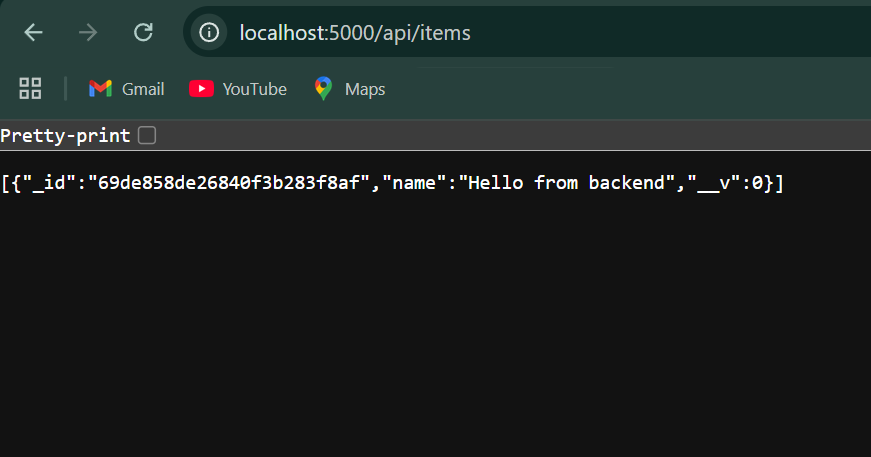
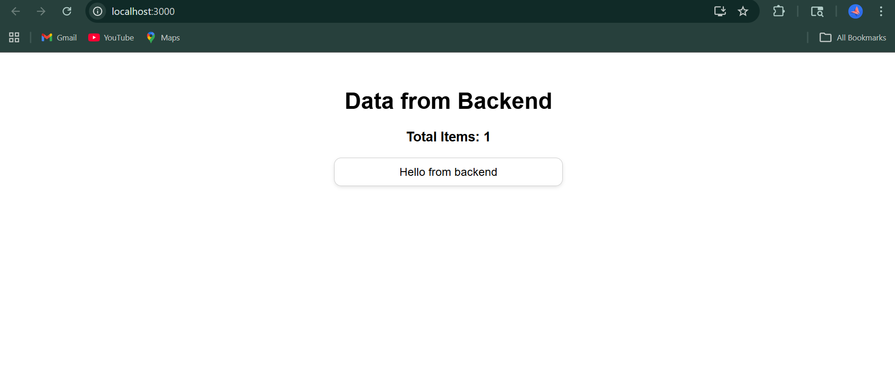

# MERN Task 1

This project demonstrates the connection between React frontend, Express backend, and MongoDB database.

## Features
- React frontend
- Express Backend
- MongoDB Atlas connection
- Data fetched from backend and displayed in frontend

## Output Screenshot

